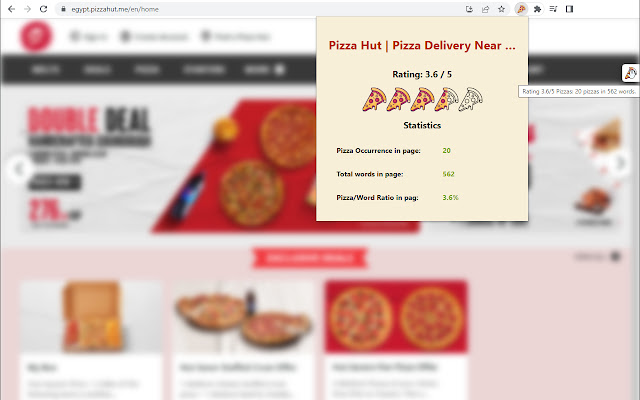
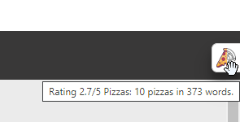
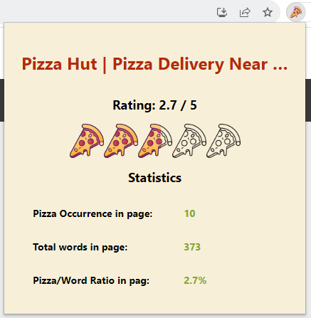

<p align="center">
    <a href="https://chrome.google.com/webstore/detail/pizza-rate/banlgaobdppjacohhfffeblfblibphjj">
        
    </a>
</p>

# Pizza Rating Chrome Extension

The chrome extenstion can be downloaded from the chrome web store [here](https://chrome.google.com/webstore/detail/pizza-rate/banlgaobdppjacohhfffeblfblibphjj).

## Description
Pizza rate extension provides the needed rating and statistics regarding the occurrence of "Pizza" in the content of a website.

You want to know if a website is good or not? Just click on the extensions icon and it will give you the statistics to make that decision.

Score out of 5 Pizzas, allows you to know which sites are faithful to the holy pizza, and which need more faith.

## How it works

<p align="center">
    
</p>

### Overlay Pizza Rating
<p align="center">
    
</p>
On the right hand side of the page in the browser, there is a overlayed tab with a pizza indicator. The pizza indicator's color is filled depending on the rating the page has. 

When hovering on the overlayed pizza indicator, a tooltip will show some details about the page rating.

### Detailed Pizza Rating
<p align="center">
    
</p>
If the overlayed pizza indicator doesnt satisfy your hunger for pizza statistics of the page, then click on the pizza rate chrome extension icon. A popup will apear with that displays detailed pizza statistics about the page.  

## How is the Pizza rate calculated
To calculate the pizza rating of the page, we would need to ratio between occurance of "pizza" and the total word count.

The rating is then measured from 0 to 5 pizzas depending on this ratio, where ratios greater or equal to 5% is considered a 5/5 pizzas.

```
    Pizza Rating = (Pizza to word ratio / 5%) * 5
```